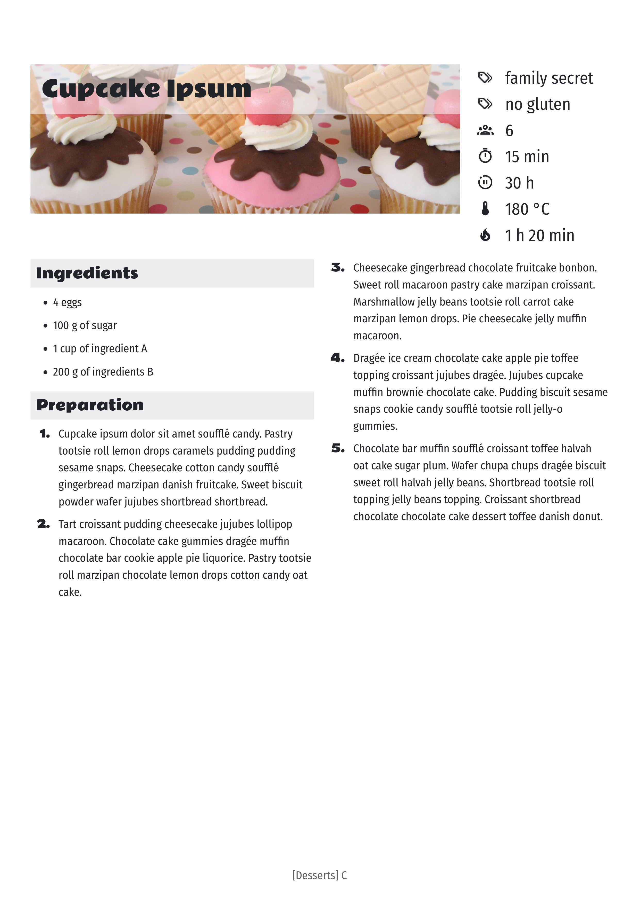

# recipes-notion-to-pdf

This script permits to generate a PDF document that can be easily printed as a clean recipes book from recipes stored in a Notion database.
It generates:
- a book title (with an illustration)
- an index of all recipes in each section (with colored labels)
- a section for starters (with an illustration)
- a section for main dishes (with an illustration)
- a section for desserts (with an illustration)
- a section for sausages (with an illustration)
- a section for cocktails (with an illustration)
- a section for others (with an illustration)

For each recipe, it displays:
- title/name
- illustration (from Notion database)
- tags
- number of people
- preparation duration
- preparation duration
- cooking duration
- rest duration
- temperature
- recipe (page content)

Minimal internationalisation is done: all Notion database attributes name are settable in `.env`.



## Installation

```sh
git clone https://github.com/seb-ma/recipes-notion-to-pdf
cd recipes-notion-to-pdf
npm install
```

## Configuration

Create an application key to access the Notion database. See [Learn how to make your first API requests using the Notion API](https://developers.notion.com/docs/getting-started)

Copy `.env.sample` to `.env` and set parameters of the Notion database.
The Notion database must have some properties defined (cooking time and so on), each property name must be set according to the database.

```sh
cp .env.sample .env
nano .env
```

## Usage

```sh
npm run start /tmp/recipes
```

The PDF `/tmp/recipes.pdf` is then generated and ready to be printed.
NB: There is also a `.html` file in the same folder.

**Warning** Some CSS parts are not well managed by pagedjs with Chrome/Chromium (the process stops on first block in error).
In this case, open the `html` file in Firefox and generate PDF in browser.
